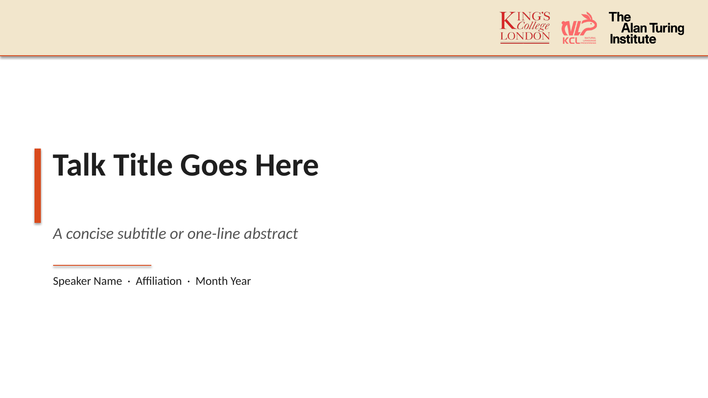
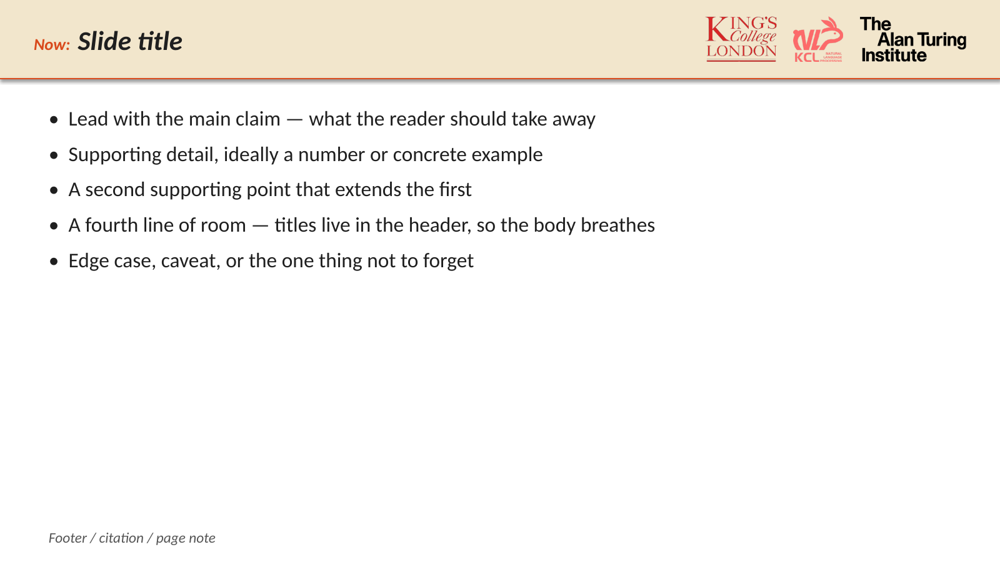
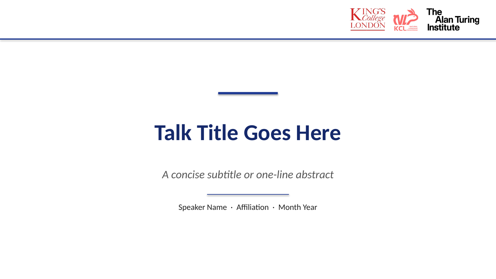
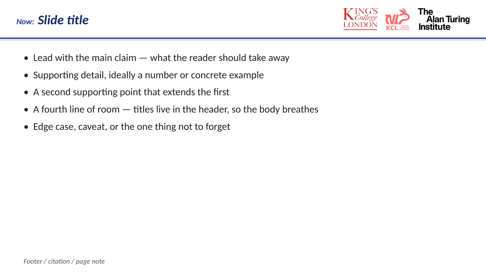
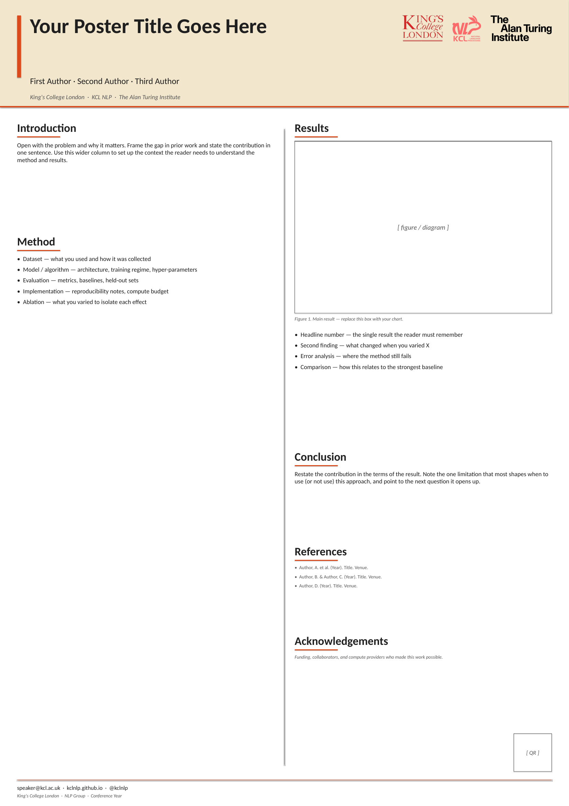
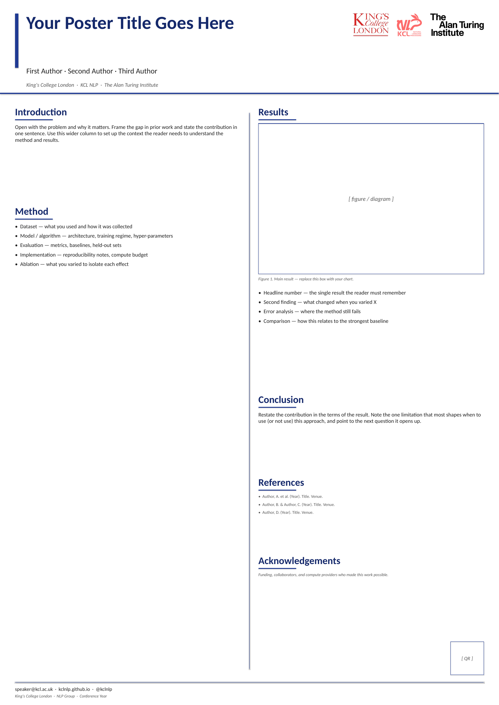

# KCLNLP_SlidesTemplate

PowerPoint templates for the **KCL NLP** research group, designed for consistent outreach and presentation of our research work (talks, posters, seminars, reading groups, etc.).

## Slides Templates

### Tree Yellow

A warm 16:9 deck. A cream header band carries the slide title on the left (as **"Now: <title>"**) and the KCL, KCLNLP, and Alan Turing Institute logos on the right, separated from the body by a thick orange rule. Titles live in the header so the body has the full slide for content. Typography: Calibri throughout.

| Title page | Content page |
| --- | --- |
|  |  |

- Download: [`templates/tree_yellow/KCLNLP_TreeYellow.pptx`](templates/tree_yellow/KCLNLP_TreeYellow.pptx)
- Layouts included: title (left-aligned + centered variants), section divider, content (title + bullets), two-column (figure + text), thank-you / Q&A (left-aligned + centered variants).
- Main colors:
  - `#F2E6CC` — cream header-band background
  - `#D94A1C` — orange rule under the header, vertical accent bar on title/divider slides, section titles, and the "Now:" label
  - `#1F1F1F` — slide titles and primary body text
  - `#555555` — secondary / italic text (subtitles, captions, footer)

### Royal Blue

A formal academic 16:9 deck. White background with a thick royal-blue rule framing the header; the slide title sits on the left as **"Now: <title>"** and the three logos on the right. Monochromatic blue-and-white palette — conference-poster / journal-house feel. Typography: Calibri throughout.

| Title page | Content page |
| --- | --- |
|  |  |

- Download: [`templates/royal_blue/KCLNLP_RoyalBlue.pptx`](templates/royal_blue/KCLNLP_RoyalBlue.pptx)
- Same layouts as Tree Yellow.
- Main colors:
  - `#1F3A93` — royal-blue rule under the header, vertical accent bar on title/divider slides, section titles, and the "Now:" label
  - `#15296B` — deep navy for slide titles and emphasised headings
  - `#1F1F1F` — primary body text
  - `#555555` — secondary / italic text (subtitles, captions, footer)

### Sage Mist

A sage-green Morandi 16:9 deck for academic talks, built on a new "Side Rail" skeleton: a thin full-bleed brand-color bar runs down the left edge, the slide title sits in the body (no header band), and a single-line footer carries the institution on the left and the three logos — tinted to match the rail — on the right. Body content gets the full slide height to breathe. Typography: Calibri for headings and body, Georgia italic for pull-quotes.

| Title page | Content page |
| --- | --- |
|  |  |

- Download: [`templates/sage_mist/KCLNLP_SageMist.pptx`](templates/sage_mist/KCLNLP_SageMist.pptx)
- Layouts included: title (left-aligned + centered), section divider with large numeral, content (title + bullets), content with TAKEAWAY callout overlay, numbered list (01 / 02 / 03), two-column (figure + text), pull-quote (Georgia italic), thanks / Q&A.
- Main colors:
  - `#5C7261` — sage-green rail, slide-title underline rule, section numerals, footer accent
  - `#A7B5A0` — lighter sage for decorative rules and pull-quote glyphs
  - `#EDEAE0` — cream tint for TAKEAWAY callout fill
  - `#2B2F2A` — primary text (warm near-black)
  - `#6F756C` — secondary / italic text (captions, footer) — tinted toward the rail rather than neutral grey, keeping the Morandi feel

### Dusty Rose

A dusty-rose Morandi 16:9 deck for academic talks. Shares the Side Rail skeleton with Sage Mist — only the palette differs. Humanist, considered feel; pairs well with talks in linguistics, language, and the social/cognitive side of NLP. Typography: Calibri for headings and body, Georgia italic for pull-quotes.

| Title page | Content page |
| --- | --- |
|  |  |

- Download: [`templates/dusty_rose/KCLNLP_DustyRose.pptx`](templates/dusty_rose/KCLNLP_DustyRose.pptx)
- Same layouts as Sage Mist.
- Main colors:
  - `#8A5E5A` — dusty-rose rail, slide-title underline rule, section numerals, footer accent
  - `#C9A9A1` — lighter rose for decorative rules and pull-quote glyphs
  - `#F2EBE6` — warm beige tint for TAKEAWAY callout fill
  - `#2E2625` — primary text (warm near-black brown)
  - `#736A68` — secondary / italic text (captions, footer) — tinted warm grey to keep the Morandi feel

## Posters Templates

A0 portrait (841 × 1189 mm) single-page posters that match each deck's style. Royal Blue and Tree Yellow posters lay out a header band with title, authors, affiliations, and the three logos, then a two-column body (Introduction / Method | Results / Conclusion / References / Acknowledgements), with a contact footer and a QR-code placeholder bottom-right. Sage Mist and Dusty Rose posters carry the same two-column body but use the deck's Side Rail skeleton — a full-bleed vertical brand bar down the left edge — with the logos kept in the header (right of the title) since on an A0 sheet the footer sits below the viewer's eye-line.

### Tree Yellow poster

  

- Download: [`templates/tree_yellow/KCLNLP_TreeYellow_Poster.pptx`](templates/tree_yellow/KCLNLP_TreeYellow_Poster.pptx)

### Royal Blue poster

  

- Download: [`templates/royal_blue/KCLNLP_RoyalBlue_Poster.pptx`](templates/royal_blue/KCLNLP_RoyalBlue_Poster.pptx)

### Sage Mist poster

  

- Download: [`templates/sage_mist/KCLNLP_SageMist_Poster.pptx`](templates/sage_mist/KCLNLP_SageMist_Poster.pptx)

### Dusty Rose poster

  

- Download: [`templates/dusty_rose/KCLNLP_DustyRose_Poster.pptx`](templates/dusty_rose/KCLNLP_DustyRose_Poster.pptx)

## Usage

1. Download the `.pptx` file for the template you want (deck or poster).
2. Open in PowerPoint / Keynote / LibreOffice Impress.
3. Replace the placeholder content with your own, keeping the logo header (Royal Blue / Tree Yellow) or footer (Sage Mist / Dusty Rose) intact.
4. For Royal Blue / Tree Yellow decks, put the slide title in the header (not the body). For Sage Mist / Dusty Rose decks, the title sits in the body — just keep the short brand-color rule beneath it.
5. For posters, swap the figure placeholder for your own chart and replace the QR-code box with a link to the paper/code.

## Contributing

Contributions from lab members are welcome — new templates, refinements, or preview screenshots. Keep fonts, colours, and the KCL NLP logo consistent with existing templates.

## License

TBD.
