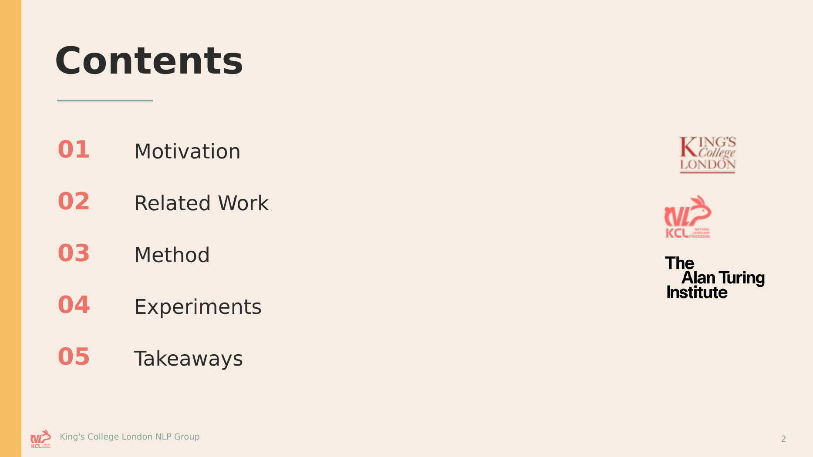
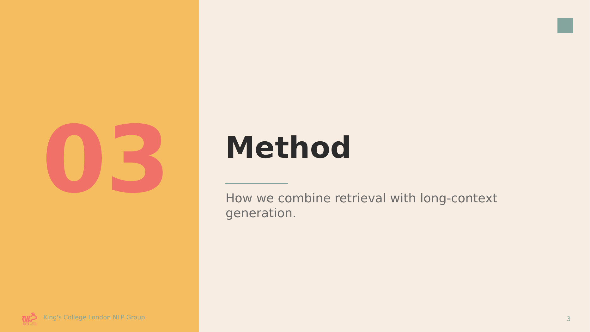
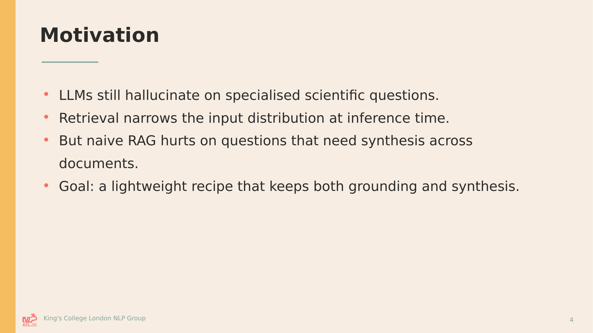
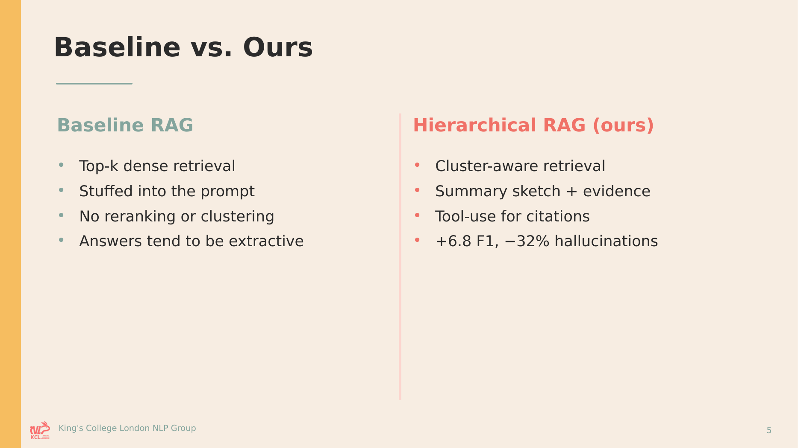
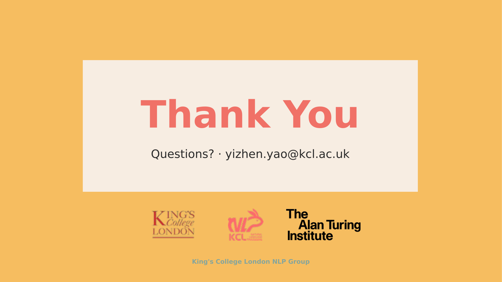

# KCLNLP_SlidesTemplate

PowerPoint templates for the **King's College London NLP Group**, for consistent outreach and presentation of our research work (talks, reading groups, seminars, posters).

## Available templates

### Paper Yellow — v1

Warm paper-yellow + sage + terracotta palette with 6 layouts. Suitable for conference talks, group meetings, and general outreach.

| | | |
|---|---|---|
|  |  |  |
| **01 Title** | **02 Table of Contents** | **03 Section Divider** |
|  |  |  |
| **04 Content — Single Column** | **05 Content — Two Column** | **06 Closing / Thanks** |

Files live in [`templates/paper-yellow/`](templates/paper-yellow/), example deck in [`examples/paper-yellow/`](examples/paper-yellow/), palette and typography reference in [`templates/paper-yellow/palette.md`](templates/paper-yellow/palette.md).

## Which file do I open?

Each template ships **three files**. Pick based on what you're trying to do:

| File | Purpose | When to use |
|---|---|---|
| `templates/paper-yellow/KCLNLP-PaperYellow.potx` | Installable PowerPoint **template** | You want our layouts in **every** new deck — install once, get *File → New → KCLNLP-PaperYellow* forever. |
| `templates/paper-yellow/KCLNLP-PaperYellow.pptx` | Blank styled **presentation** | One-off talk. Open, *Save As*, fill in content. No install needed. |
| `examples/paper-yellow/KCLNLP-PaperYellow-Example.pptx` | Populated **example** deck | Just browsing what the template looks like. **Don't edit this** — use one of the above instead. |

## How to use

### Option A — Install the `.potx` (recommended for regular use)

**Windows**
1. Download `templates/paper-yellow/KCLNLP-PaperYellow.potx`.
2. Double-click → PowerPoint opens a new untitled deck based on it, or
3. Copy it to `%AppData%\Microsoft\Templates\` to have it appear under *File → New → Personal / Custom*.
4. When working in a deck: *Home → New Slide ▾* shows the six layouts (01 Title, 02 Table of Contents, …).

**macOS**
1. Download `templates/paper-yellow/KCLNLP-PaperYellow.potx`.
2. Copy it to `~/Library/Group Containers/UBF8T346G9.Office/User Content.localized/Templates.localized/` (create the folder if missing).
3. In PowerPoint: *File → New from Template → KCLNLP-PaperYellow*.

### Option B — Open the blank `.pptx` (quick one-off)

1. Download `templates/paper-yellow/KCLNLP-PaperYellow.pptx`.
2. Open it, then *File → Save As* to a name of your own.
3. Start editing — the six layouts are already available in *Home → New Slide ▾*.

### Option C — Start from the example

Open `examples/paper-yellow/KCLNLP-PaperYellow-Example.pptx` to see every layout populated. Copy any slide out of it into your own deck (PowerPoint preserves styling), or use it as visual reference while following Option A/B.

## Font notes

Theme fonts (set in the master):

| Slot | Latin | Chinese (Hans) |
|---|---|---|
| Major (titles) | Aptos Display | 等线 Light |
| Minor (body)   | Aptos         | 等线 |

- **Aptos / Aptos Display** ship with Microsoft 365 (2023+).
- **等线 (DengXian) / 等线 Light** ship with Windows.
- On machines without these fonts, PowerPoint and other viewers substitute automatically — readable but not pixel-identical to the previews. Install the fonts manually if you want full fidelity.

## Repository layout

```
KCLNLP_SlidesTemplate/
├── README.md
├── .gitignore
├── templates/
│   └── paper-yellow/
│       ├── KCLNLP-PaperYellow.pptx
│       ├── KCLNLP-PaperYellow.potx
│       └── palette.md
├── examples/
│   └── paper-yellow/
│       └── KCLNLP-PaperYellow-Example.pptx
├── previews/
│   └── paper-yellow/
│       └── 01-title.png … 06-closing.png
├── assets/
│   └── logos/
│       ├── KCL.png
│       ├── KCLNLP.png
│       └── Alan.png
└── scripts/
    └── build_paper_yellow.py      # reproducible build
```

Institutional logos under `assets/logos/` are shared across all templates.

## Contributing

To add a new template (say, a dark-mode or poster variant):

1. Add `templates/<name>/`, `examples/<name>/`, `previews/<name>/`.
2. Write `scripts/build_<name>.py` following the pattern in `build_paper_yellow.py`.
3. Run your build script and render previews:
   ```bash
   python scripts/build_<name>.py
   soffice --headless --convert-to pdf examples/<name>/*.pptx
   pdftoppm -png -r 140 <pdf> previews/<name>/slide
   ```
4. Update this README with a preview row + links.
5. Keep the three signature institutional logos + the footer wordmark consistent across templates.

## Rebuilding the Paper Yellow template

Requirements:

- Python ≥ 3.10 with `python-pptx`, `Pillow`, `lxml`
- LibreOffice (`soffice`) + Poppler (`pdftoppm`) for preview rendering

```bash
python scripts/build_paper_yellow.py
```

Writes the three output files under `templates/paper-yellow/` and `examples/paper-yellow/`. Re-render previews with `soffice` + `pdftoppm` as shown above.

## Licence

TBD — ask Yizhen before redistributing externally. Logos belong to their respective institutions (KCL, KCL NLP Group, The Alan Turing Institute).
