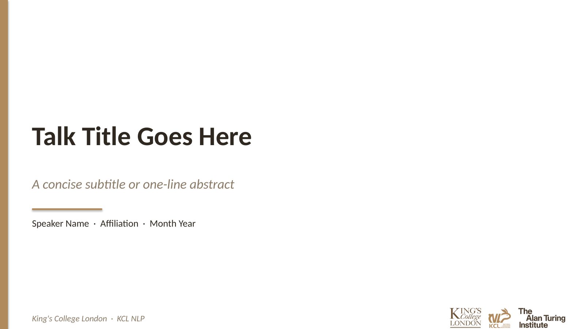
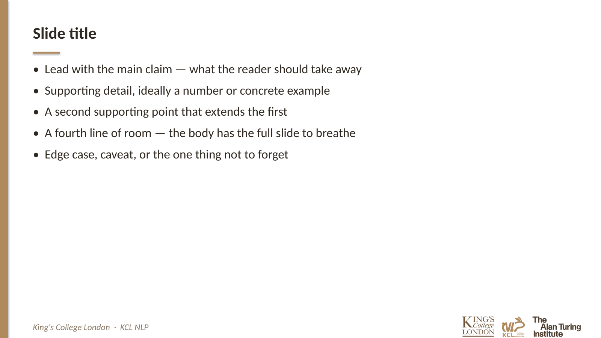
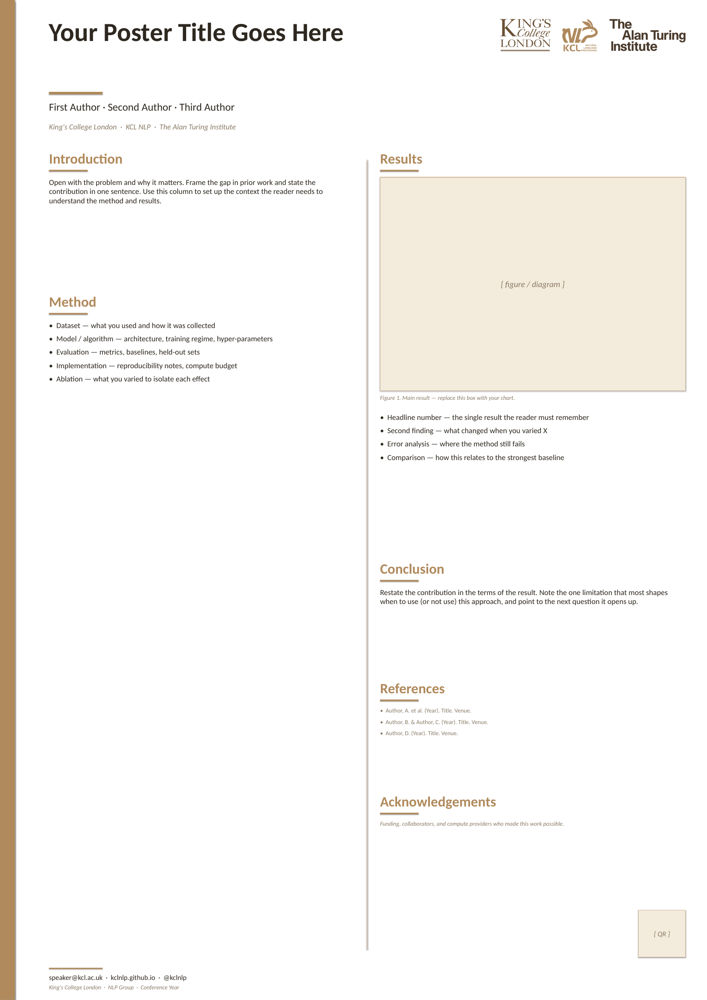

# KCLNLP_SlidesTemplate

PowerPoint templates for the **KCL NLP** research group, designed for consistent outreach and presentation of our research work (talks, posters, seminars, reading groups, etc.).

All four templates share a single **Side Rail** skeleton — a thin full-bleed vertical brand-color bar runs down the left edge, the slide title sits in the body (no header band), and a single-line footer carries the institution on the left and the three logos — tinted to match the rail — on the right. Body content gets the full slide height to breathe. Only the Morandi palette differs between templates. Typography: Calibri for headings and body, Georgia italic for pull-quotes.

## Slides Templates

### Sage Mist

A sage-green Morandi 16:9 deck for academic talks. Natural, restrained feel; pairs well with talks in computational linguistics, evaluation, and the empirical side of NLP.

| Title page | Content page |
| --- | --- |
|  |  |

- Download: [`templates/sage_mist/KCLNLP_SageMist.pptx`](templates/sage_mist/KCLNLP_SageMist.pptx)
- Layouts included: title (left-aligned + centered), section divider with large numeral, content (title + bullets), content with TAKEAWAY callout overlay, numbered list (01 / 02 / 03), two-column (figure + text), pull-quote (Georgia italic), thanks / Q&A.
- Main colors:
  - `#5C7261` — sage-green rail, slide-title underline rule, section numerals, footer accent
  - `#A7B5A0` — lighter sage for decorative rules and pull-quote glyphs
  - `#EDEAE0` — cream tint for TAKEAWAY callout fill
  - `#2B2F2A` — primary text (warm near-black)
  - `#6F756C` — secondary / italic text (captions, footer) — tinted toward the rail rather than neutral grey, keeping the Morandi feel

### Dusty Rose

A dusty-rose Morandi 16:9 deck for academic talks. Humanist, considered feel; pairs well with talks in linguistics, language, and the social / cognitive side of NLP.

| Title page | Content page |
| --- | --- |
|  |  |

- Download: [`templates/dusty_rose/KCLNLP_DustyRose.pptx`](templates/dusty_rose/KCLNLP_DustyRose.pptx)
- Same layouts as Sage Mist.
- Main colors:
  - `#8A5E5A` — dusty-rose rail, slide-title underline rule, section numerals, footer accent
  - `#C9A9A1` — lighter rose for decorative rules and pull-quote glyphs
  - `#F2EBE6` — warm beige tint for TAKEAWAY callout fill
  - `#2E2625` — primary text (warm near-black brown)
  - `#736A68` — secondary / italic text (captions, footer) — tinted warm grey to keep the Morandi feel

### Ochre Clay

A warm ochre / terracotta Morandi 16:9 deck. More restrained than a saturated yellow; reads earthy and grounded, well suited to applied / industry-facing talks.

| Title page | Content page |
| --- | --- |
|  |  |

- Download: [`templates/ochre_clay/KCLNLP_OchreClay.pptx`](templates/ochre_clay/KCLNLP_OchreClay.pptx)
- Same layouts as Sage Mist.
- Main colors:
  - `#B08A5C` — ochre rail, slide-title underline rule, section numerals, footer accent
  - `#D4B89A` — lighter sand for decorative rules and pull-quote glyphs
  - `#F3EBDB` — cream tint for TAKEAWAY callout fill
  - `#2E2820` — primary text (warm near-black)
  - `#8A7A66` — secondary / italic text (captions, footer) — tinted toward the rail to keep the Morandi feel

### Deep Plum

A deep-plum Morandi 16:9 deck. Sober and scholarly without reading as cold or corporate; a deliberate alternative to a saturated blue for thesis-defence-style decks and formal seminars.

| Title page | Content page |
| --- | --- |
|  |  |

- Download: [`templates/deep_plum/KCLNLP_DeepPlum.pptx`](templates/deep_plum/KCLNLP_DeepPlum.pptx)
- Same layouts as Sage Mist.
- Main colors:
  - `#6F5C7A` — plum rail, slide-title underline rule, section numerals, footer accent
  - `#B4A0B8` — lighter mauve for decorative rules and pull-quote glyphs
  - `#ECE5EC` — pale lilac tint for TAKEAWAY callout fill
  - `#2A2530` — primary text (warm near-black)
  - `#75707A` — secondary / italic text (captions, footer) — tinted toward the rail to keep the Morandi feel

## Posters Templates

A0 portrait (841 × 1189 mm) single-page posters that match each deck's Side Rail style. The full-bleed vertical brand bar runs down the left edge of the entire sheet, and the two-column body lays out Introduction / Method on the left and Results / Conclusion / References / Acknowledgements on the right. Logos sit in the header (right of the title) rather than the footer — on an A0 sheet the footer sits below the viewer's eye-line, so the logos belong with the title. A contact footer and QR-code placeholder sit bottom-right.

### Sage Mist poster

  

- Download: [`templates/sage_mist/KCLNLP_SageMist_Poster.pptx`](templates/sage_mist/KCLNLP_SageMist_Poster.pptx)

### Dusty Rose poster

  

- Download: [`templates/dusty_rose/KCLNLP_DustyRose_Poster.pptx`](templates/dusty_rose/KCLNLP_DustyRose_Poster.pptx)

### Ochre Clay poster

  

- Download: [`templates/ochre_clay/KCLNLP_OchreClay_Poster.pptx`](templates/ochre_clay/KCLNLP_OchreClay_Poster.pptx)

### Deep Plum poster

  

- Download: [`templates/deep_plum/KCLNLP_DeepPlum_Poster.pptx`](templates/deep_plum/KCLNLP_DeepPlum_Poster.pptx)

## Usage

1. Download the `.pptx` file for the template you want (deck or poster).
2. Open in PowerPoint / Keynote / LibreOffice Impress.
3. Replace the placeholder content with your own, keeping the side rail, the footer logos (decks) or header logos (posters), and the short brand-color rule beneath the slide title.
4. The slide title sits in the body, not in a header band — just keep the short brand-color rule under it for visual consistency.
5. For posters, swap the figure placeholder for your own chart and replace the QR-code box with a link to the paper / code.

## Contributing

Contributions from lab members are welcome — new Morandi palettes, layout refinements, or preview screenshots. Keep the Side Rail skeleton, the Calibri / Georgia typography, and the KCL NLP logo set consistent with existing templates. When adding a new palette, follow the convention of tinting the three logos to a Morandi triad (deep / mid / deepest) so the logos sit visually with the rail rather than as separate full-colour marks.

## License

TBD.
