# KCLNLP_SlidesTemplate

PowerPoint templates for the **KCL NLP** research group, designed for consistent outreach and presentation of our research work (talks, posters, seminars, reading groups, etc.). Five deck templates are included: **Original Standard** (the canonical KCL look) plus four Morandi-palette variants — **Sage Mist**, **Dusty Rose**, **Faded Indigo**, and **Deep Plum** — that share a common Side Rail skeleton (a thin full-bleed vertical brand-color bar down the left edge, the slide title in the body rather than a header band, and a single-line footer with the institution on the left and the three logos tinted to match the rail on the right). Typography across the Morandi variants: Calibri for headings and body, Georgia italic for pull-quotes.

## Slides Templates

### Original Standard

The original KCL-branded deck for the group — the canonical look. King's College London mark sits in the top-right of the title slide and as a smaller mark on content slides; the KCL NLP logo lockup anchors the bottom-left of the title footer.

| Title page | Content page |
| --- | --- |
| 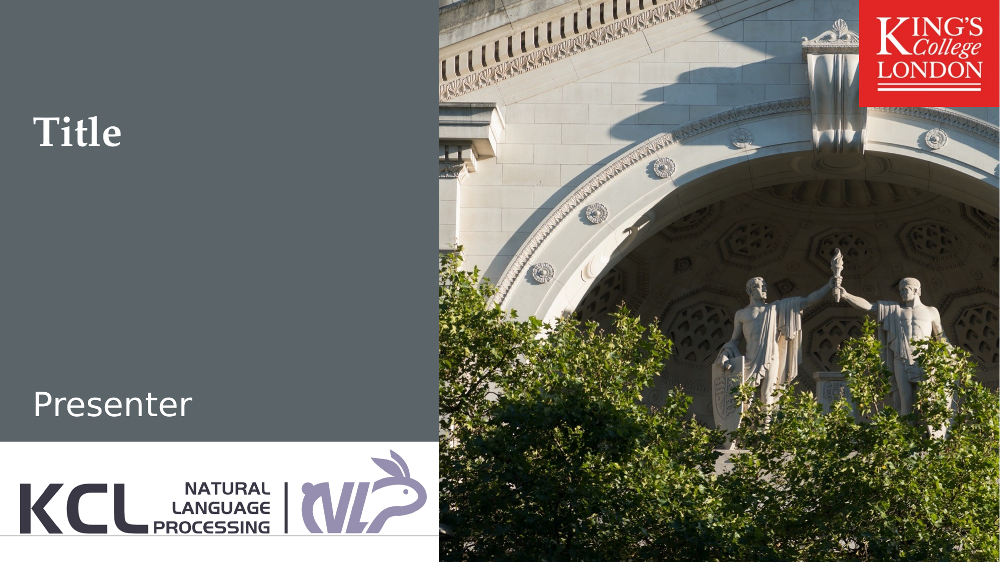 | 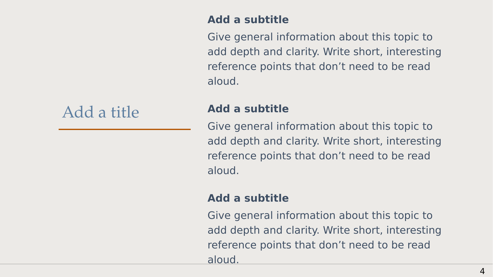 |

- Download: [`templates/original_standard/KCLNLP_OriginalStandard.potx`](templates/original_standard/KCLNLP_OriginalStandard.potx)
- 16:9. Layouts included: title slide, timeline, multi-subtitle content, closing Q&A.

### Sage Mist

A sage-green Morandi 16:9 deck for academic talks. Natural, restrained feel; pairs well with talks in computational linguistics, evaluation, and the empirical side of NLP.

| Title (plain) | Title (photo) | Content page |
| --- | --- | --- |
| 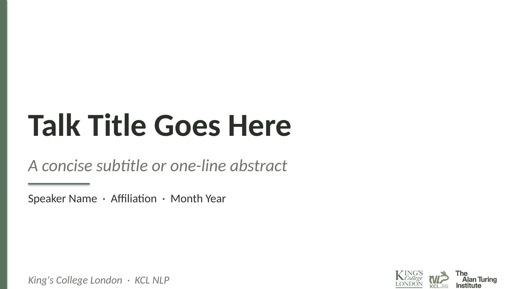 | 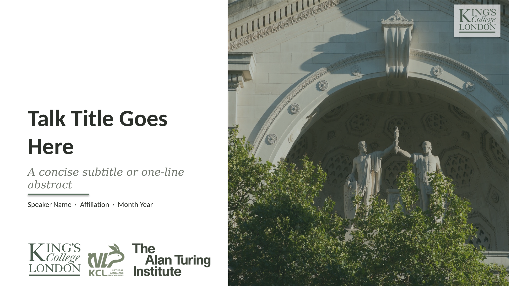 | 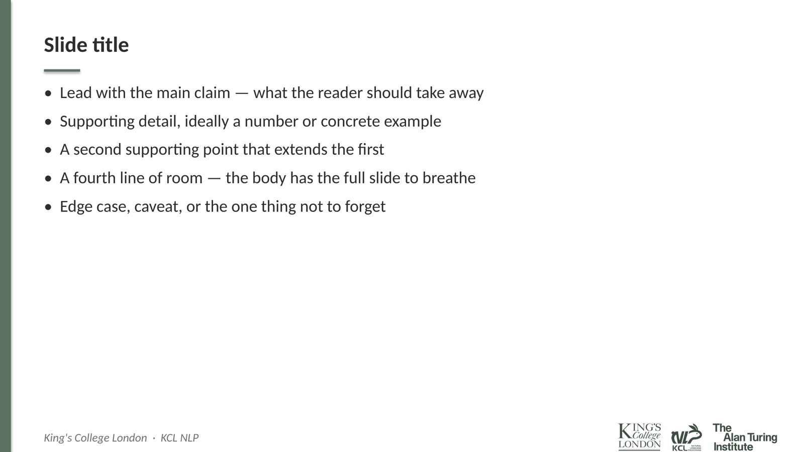 |

- Download: [`templates/sage_mist/KCLNLP_SageMist.potx`](templates/sage_mist/KCLNLP_SageMist.potx)
- Layouts included: title (left-aligned + centered + photo), section divider with large numeral, content (title + bullets), content with TAKEAWAY callout overlay, numbered list (01 / 02 / 03), two-column (figure + text), pull-quote (Georgia italic), thanks / Q&A.
- Main colors:
  - `#5C7261` — sage-green rail, slide-title underline rule, section numerals, footer accent
  - `#A7B5A0` — lighter sage for decorative rules and pull-quote glyphs
  - `#EDEAE0` — cream tint for TAKEAWAY callout fill
  - `#2B2F2A` — primary text (warm near-black)
  - `#6F756C` — secondary / italic text (captions, footer) — tinted toward the rail rather than neutral grey, keeping the Morandi feel

### Dusty Rose

A dusty-rose Morandi 16:9 deck for academic talks. Humanist, considered feel; pairs well with talks in linguistics, language, and the social / cognitive side of NLP.

| Title (plain) | Title (photo) | Content page |
| --- | --- | --- |
| 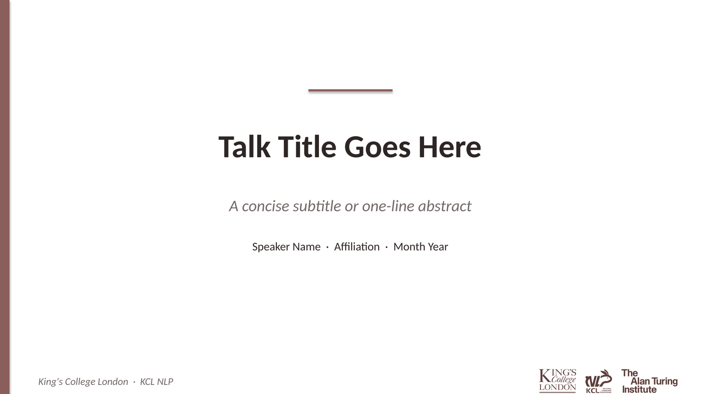 | 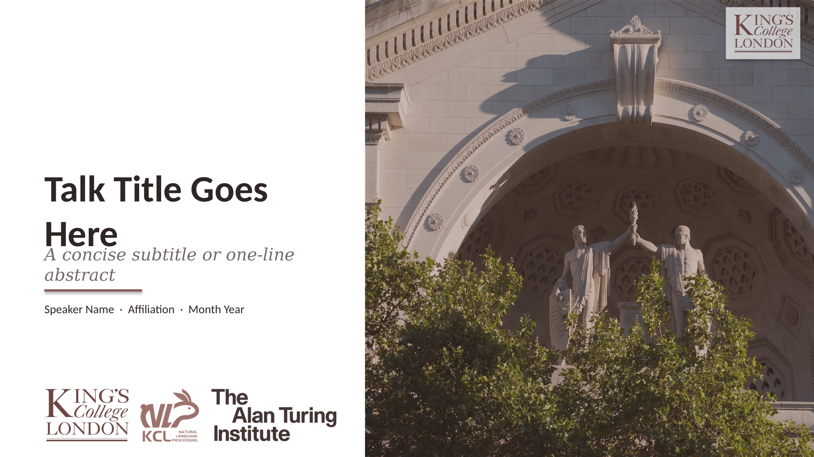 | 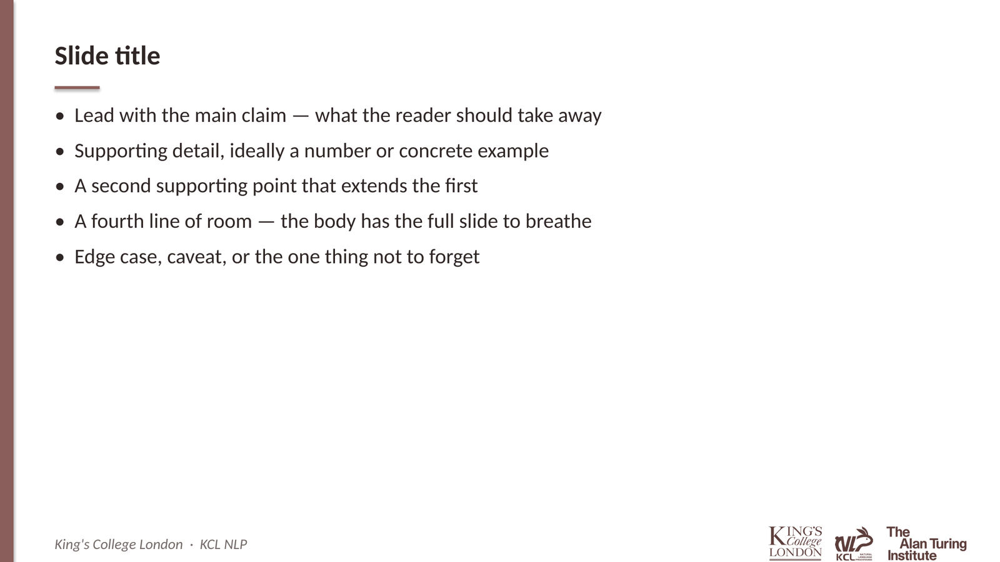 |

- Download: [`templates/dusty_rose/KCLNLP_DustyRose.potx`](templates/dusty_rose/KCLNLP_DustyRose.potx)
- Same layouts as Sage Mist.
- Main colors:
  - `#8A5E5A` — dusty-rose rail, slide-title underline rule, section numerals, footer accent
  - `#C9A9A1` — lighter rose for decorative rules and pull-quote glyphs
  - `#F2EBE6` — warm beige tint for TAKEAWAY callout fill
  - `#2E2625` — primary text (warm near-black brown)
  - `#736A68` — secondary / italic text (captions, footer) — tinted warm grey to keep the Morandi feel

### Faded Indigo

A faded-indigo Morandi 16:9 deck. Sober and grounded — the family's deepest, most "old book cover" voice. A deliberate alternative to a saturated corporate blue; reads cool but not cold, well suited to thesis-defence-style decks and formal seminars.

| Title (plain) | Title (photo) | Content page |
| --- | --- | --- |
| 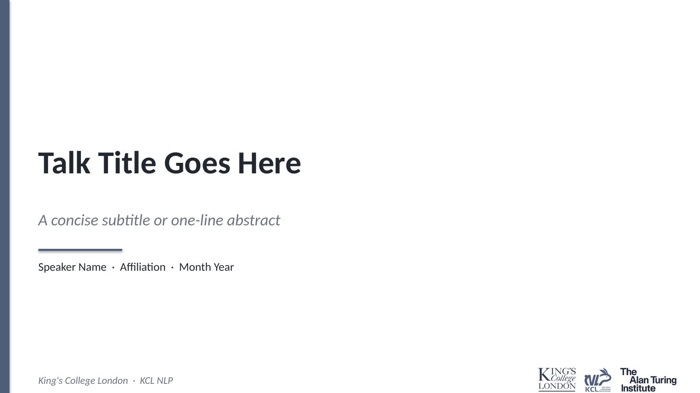 | 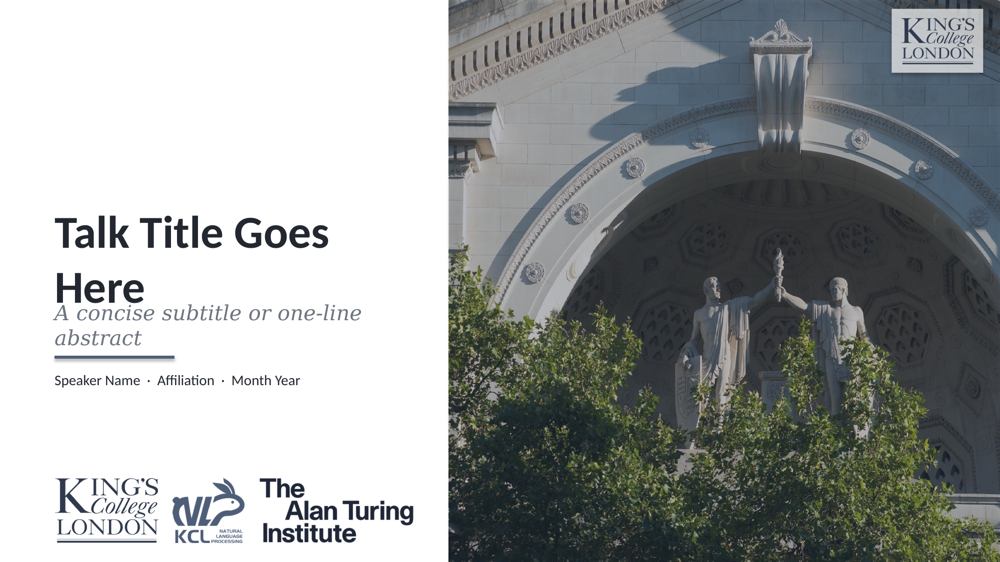 | 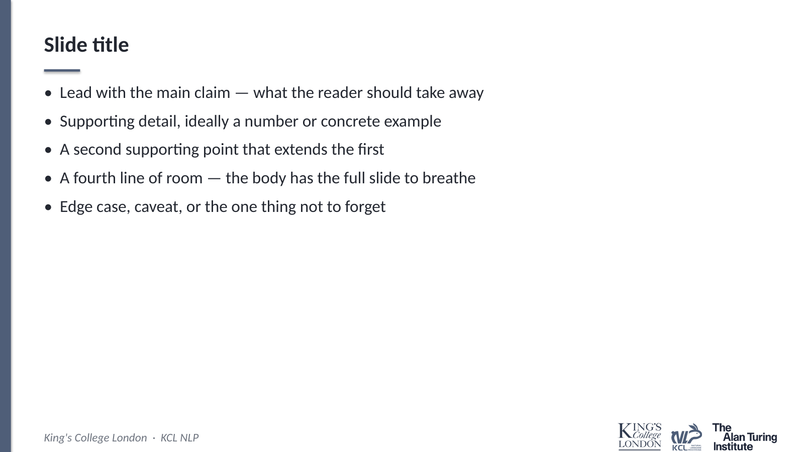 |

- Download: [`templates/faded_indigo/KCLNLP_FadedIndigo.potx`](templates/faded_indigo/KCLNLP_FadedIndigo.potx)
- Same layouts as Sage Mist.
- Main colors:
  - `#4F5E78` — faded-indigo rail, slide-title underline rule, section numerals, footer accent
  - `#A0AAB8` — lighter slate for decorative rules and pull-quote glyphs
  - `#E5E8EC` — pale slate tint for TAKEAWAY callout fill
  - `#232730` — primary text (cool near-black)
  - `#6E747F` — secondary / italic text (captions, footer) — tinted toward the rail to keep the Morandi feel

### Deep Plum

A deep-plum Morandi 16:9 deck. Sober and scholarly without reading as cold or corporate; a deliberate alternative to a saturated blue for thesis-defence-style decks and formal seminars.

| Title (plain) | Title (photo) | Content page |
| --- | --- | --- |
| 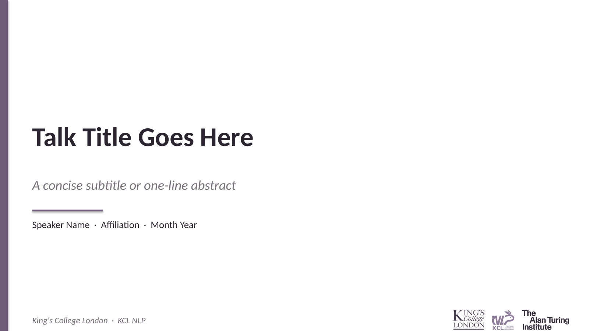 | 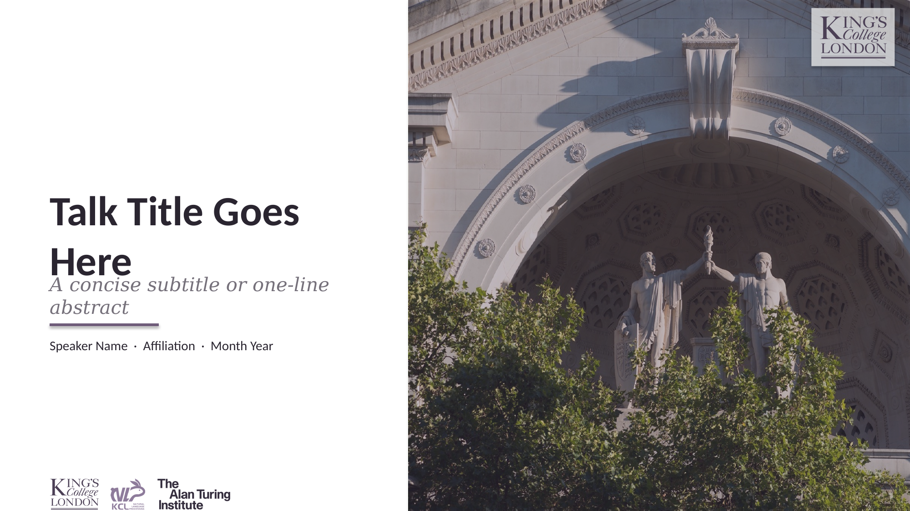 | 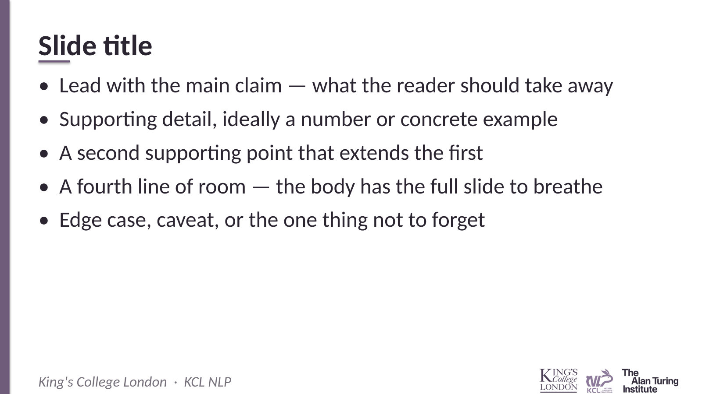 |

- Download: [`templates/deep_plum/KCLNLP_DeepPlum.potx`](templates/deep_plum/KCLNLP_DeepPlum.potx)
- Same layouts as Sage Mist.
- Main colors:
  - `#6F5C7A` — plum rail, slide-title underline rule, section numerals, footer accent
  - `#B4A0B8` — lighter mauve for decorative rules and pull-quote glyphs
  - `#ECE5EC` — pale lilac tint for TAKEAWAY callout fill
  - `#2A2530` — primary text (warm near-black)
  - `#75707A` — secondary / italic text (captions, footer) — tinted toward the rail to keep the Morandi feel

## Posters Templates

A0 portrait (841 × 1189 mm) single-page posters that match each deck's Side Rail style. The full-bleed vertical brand bar runs down the left edge of the entire sheet, and the two-column body lays out Introduction / Method on the left and Results / Conclusion / References / Acknowledgements on the right. Logos sit in the header (right of the title) rather than the footer — on an A0 sheet the footer sits below the viewer's eye-line, so the logos belong with the title. A contact footer and QR-code placeholder sit bottom-right.

### Sage Mist poster

  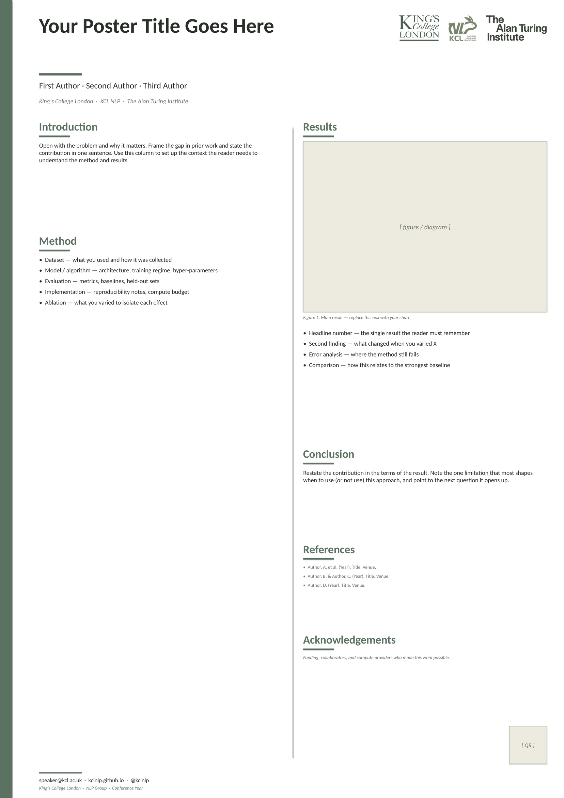

- Download: [`templates/sage_mist/KCLNLP_SageMist_Poster.potx`](templates/sage_mist/KCLNLP_SageMist_Poster.potx)

### Dusty Rose poster

  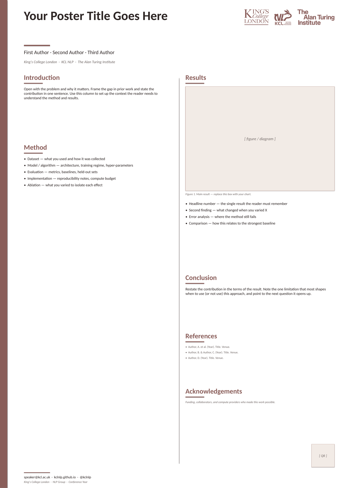

- Download: [`templates/dusty_rose/KCLNLP_DustyRose_Poster.potx`](templates/dusty_rose/KCLNLP_DustyRose_Poster.potx)

### Faded Indigo poster

  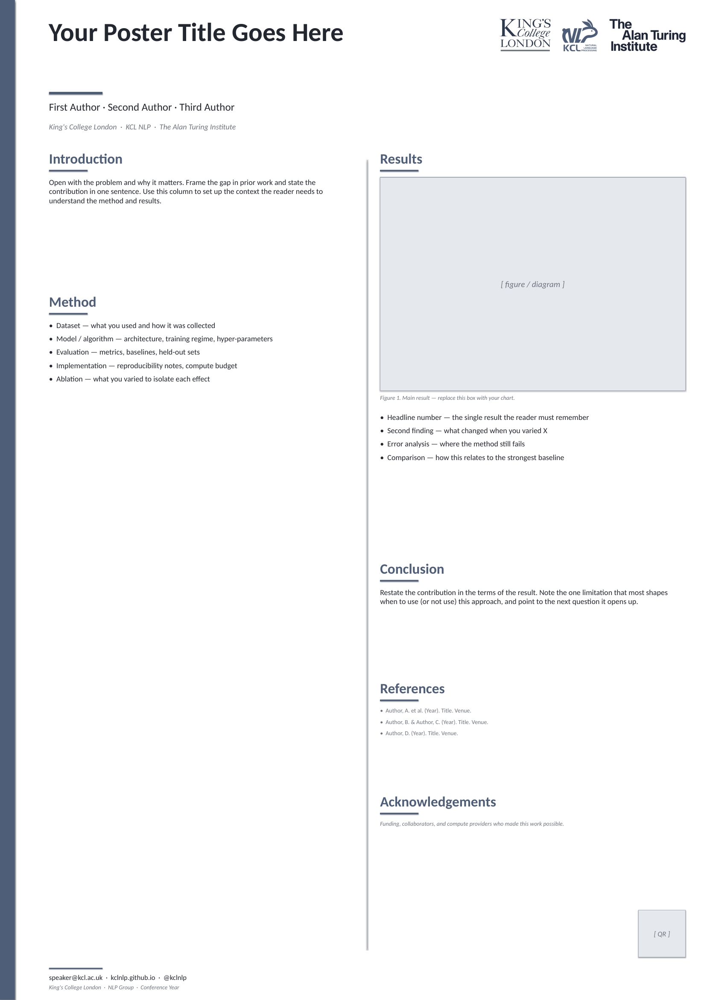

- Download: [`templates/faded_indigo/KCLNLP_FadedIndigo_Poster.potx`](templates/faded_indigo/KCLNLP_FadedIndigo_Poster.potx)

### Deep Plum poster

  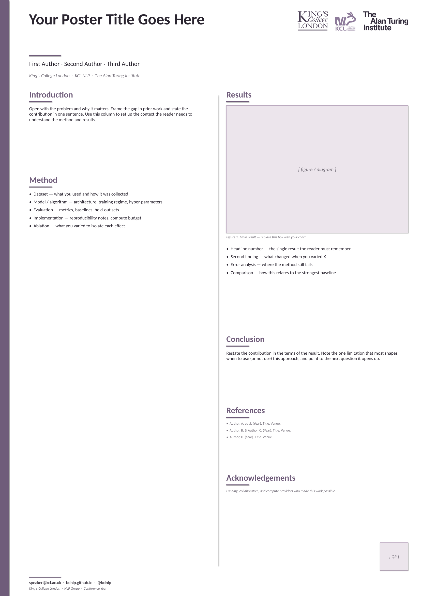

- Download: [`templates/deep_plum/KCLNLP_DeepPlum_Poster.potx`](templates/deep_plum/KCLNLP_DeepPlum_Poster.potx)

## HTML deck template

A browser-based, single-file alternative to the PowerPoint decks lives at
[`html-templates/editorial-serif/`](html-templates/editorial-serif/).
Copy `template.html`, edit the slides inline, open in any browser —
no build step. See the directory's own README for the full keyboard
map and layout reference.

Visual style: warm paper background, full serif typography, single brick-red
accent — an "editorial / Atlantic" feel, distinct from the PowerPoint decks' Morandi family.

| Title page | Content page |
| --- | --- |
| 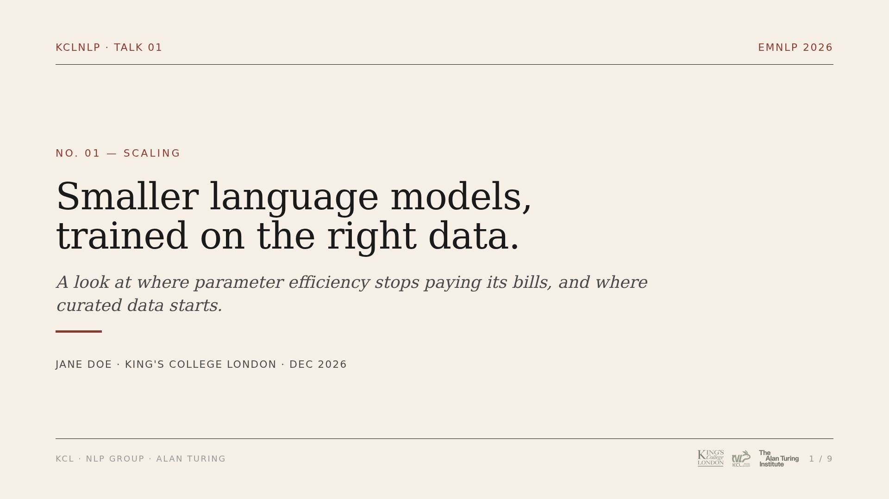 | 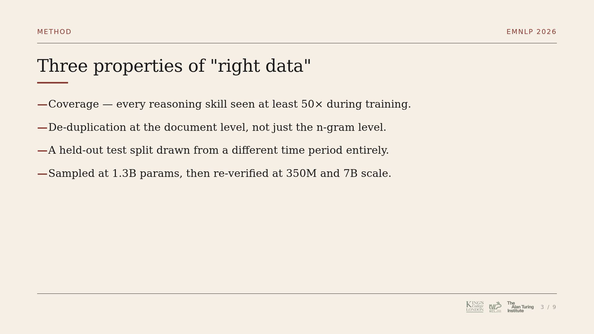 |

## Usage

1. Download the `.potx` file for the template you want (deck or poster).
2. Open in PowerPoint / Keynote / LibreOffice Impress — because it's a `.potx`, opening creates a fresh untitled deck rather than editing the template file itself.
3. Replace the placeholder content with your own, keeping the side rail, the footer logos (decks) or header logos (posters), and the short brand-color rule beneath the slide title.
4. The slide title sits in the body, not in a header band — just keep the short brand-color rule under it for visual consistency.
5. For posters, swap the figure placeholder for your own chart and replace the QR-code box with a link to the paper / code.

## Contributing

Contributions from lab members are welcome — new Morandi palettes, layout refinements, or preview screenshots. Keep the Side Rail skeleton, the Calibri / Georgia typography, and the KCL NLP logo set consistent with existing templates. When adding a new palette, follow the convention of tinting the three logos to a Morandi triad (deep / mid / deepest) so the logos sit visually with the rail rather than as separate full-colour marks.

## License

TBD.
